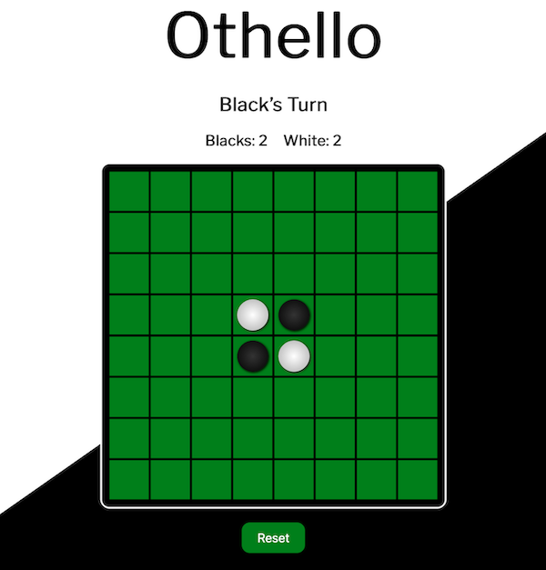

# Othello JS
Othello made with JavaScript

By: Christopher Bowers

[Trello Board](https://trello.com/b/DHE5hvNf)

## Description

Othello is a strategy board game. Two players. Two sides. One black,. One white. Players take turn placing pieces on the board to flip the opponents pieces to their own color.

## Technologies

 * HTML 
 * CSS
 * JavaScript

## How to Get Started

### Play in web browser

[Play the Othello](http://smart-trick.surge.sh) in your browser. 

### Download and run locally

`git clone git@github.com:christopherbowers/Othello-JS.git` and open `index.html` in your web browser.

## Credits

